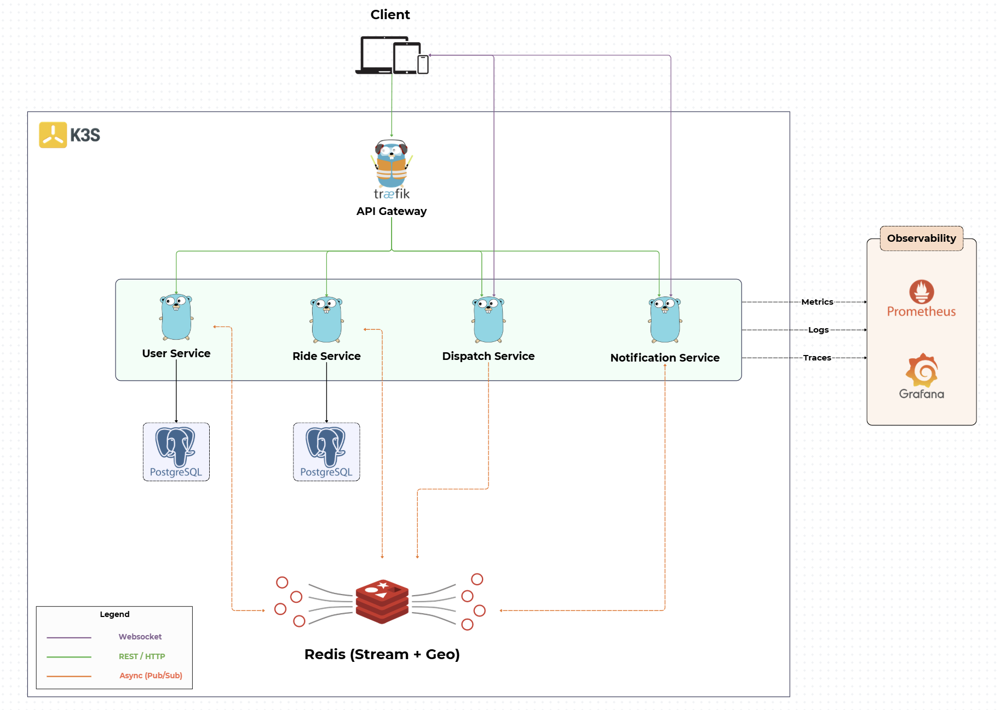
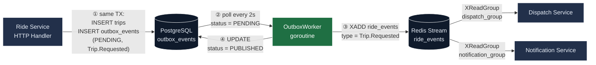
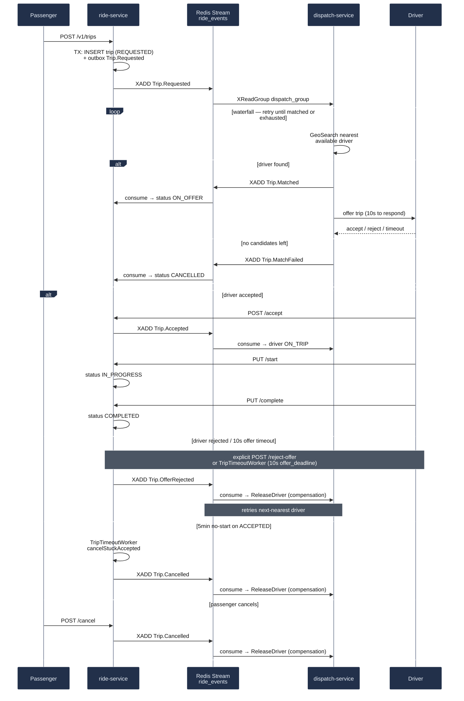

# vroom-services

[](https://gitlab.com/AmaUIT/vroom-services/-/commits/main)
[](services/user/go.mod)

Go microservices backend, React frontend, and CI/CD pipeline for the **Vroom** ride-hailing platform.

Part of a three-repo GitOps setup — each repo has a single responsibility:

| Repo | Responsibility |
|------|---------------|
| **vroom-services** (this repo) | Application source code, Dockerfiles, GitLab CI pipeline |
| [vroom-gitops](https://github.com/Ama2352/vroom-gitops) | Kustomize manifests, ArgoCD Applications, Kargo promotion CRDs |
| [vroom-infra](https://github.com/Ama2352/vroom-infra) | Vagrant + Ansible K3s cluster provisioning |

---

## Architecture

Four Go microservices communicate through **Redis Streams** using the **Outbox pattern** to guarantee delivery. Driver matching is a **Saga choreography** — no central orchestrator, compensating transactions handle failures.



### Applied patterns

| Pattern | Where | Why |
|---------|-------|-----|
| **Domain-Driven Design** | Each service's `internal/domain/` | Trip state machine + value objects own the business rules |
| **Transactional Outbox** | `ride-service` → Redis Streams | Prevents dual-write: event is committed atomically with the trip row |
| **Saga Choreography** | `ride` ↔ `dispatch` via Redis Streams | No orchestrator process; each service reacts to events and compensates on failure |
| **Consumer Groups + DLQ** | `dispatch_group`, `notification_group` on `ride_events` | At-least-once delivery with XAUTOCLAIM crash recovery; poison messages move to `ride_events_dlq` after 3 retries |
| **Repository pattern** | `internal/repository/` in each service | Isolates DB access; SQLC generates the implementation |
| **JWT RS256** | `user-service` issues; others validate via `JWT_PUBLIC_KEY_PEM` | Asymmetric — only user-service holds the private key |
| **Redis Geo** | `dispatch-service`: `drivers:available` | O(log N) radius search; 5 km waterfall to nearest driver |
| **HPA autoscaling** | `ride`, `dispatch`, `user` (CPU 60%, min=1, max=4) | Scales under load; verified by `validation/load-tests/spike.js` |
| **Distributed tracing** | OTEL → Tempo, all 4 services | `traceparent` propagated through Redis Streams, not just HTTP |
| **Structured diagnostics agent** | `incident-diagnosis/` | LLM-assisted SRE tool: collects Prometheus/Loki/K8s-events facts, one interpretation call, semantic memory of past incidents |

### Transactional Outbox

`ride-service` never publishes to Redis from the HTTP handler. Step ① writes the trip row and an `outbox_events` row in the same Postgres transaction, so the event can never be lost even if the process crashes right after `COMMIT`. `OutboxWorker` polls every 2 seconds (②), publishes the pending event to the `ride_events` Redis Stream (③), then marks it `PUBLISHED` (④) — both consumer groups pick it up independently.



### Saga Choreography

Driver matching has no orchestrator — `ride-service` and `dispatch-service` each react to events on the shared `ride_events` stream and publish the next one themselves. Every compensation is explicit about who triggers it: a rejected offer or 10s timeout is detected by `ride-service` (`TripTimeoutWorker` or `POST /reject-offer`), which publishes `Trip.OfferRejected`; `dispatch-service` consumes it, releases the driver, and the waterfall loop retries the next-nearest candidate.



---

## Repository Layout

```
vroom-services/
├── services/                    Application code
│   ├── user/                    Identity — JWT RS256, user CRUD
│   │   ├── internal/
│   │   │   ├── domain/          User entity, value objects
│   │   │   ├── handler/         Gin HTTP handlers
│   │   │   ├── repository/      DB interface + SQLC postgres impl
│   │   │   └── service/         Business logic
│   │   ├── migrations/          golang-migrate SQL files
│   │   ├── sqlc.yaml            SQLC config
│   │   └── Dockerfile.dev       Alpine + Air hot-reload
│   ├── ride/                    Trip lifecycle — Outbox publisher, Saga participant
│   │   └── internal/
│   │       ├── domain/          Trip entity + state machine (REQUESTED→COMPLETED)
│   │       ├── worker/          OutboxWorker (polls → XADD), TripTimeoutWorker
│   │       └── integration/     testcontainers integration tests
│   ├── dispatch/                 Driver matching — Saga coordinator, Redis Geo
│   │   └── internal/
│   │       ├── domain/          DriverState (AVAILABLE / ON_OFFER / ON_TRIP)
│   │       └── worker/          Redis Streams XReadGroup consumer, DLQ handling
│   ├── notification/             Event fan-out — WebSocket push, XAUTOCLAIM + DLQ
│   ├── frontend/                 React 19 + Vite (passenger + driver UIs)
│   └── tests/                    Cross-service choreography integration tests
├── incident-diagnosis/           SRE incident diagnosis agent (deployed as "incident-agent")
│   ├── agent/                    Diagnostics + interpretation — Prometheus/Loki/K8s events → root cause
│   └── kubectl-executor/         Allowlist-gated kubectl HTTP gateway
├── validation/                   Things that exercise a running deployed cluster
│   ├── load-tests/               k6 scenarios — baseline (P95<500ms), spike, geo_flood
│   └── demo/                     Chaos/resilience demo scripts (pod crash, consumer crash, DLQ)
├── local/
│   └── init-db.sql               Bootstrap DB users + schemas for docker-compose
├── docs/images/                   README diagrams
├── docker-compose.yml             Full local stack (Postgres + Redis + all services + frontend)
└── README.md
```

Each Go service follows the same internal layout — see `services/ride/internal/` above for the canonical structure.

---

## Quick Start (local, no Kubernetes needed)

```bash
# Full stack with hot reload
docker-compose up --build

# User:         http://localhost:8081
# Ride:         http://localhost:8082
# Dispatch:     http://localhost:8083
# Notification: http://localhost:8084
# Frontend:     http://localhost:5173
```

```bash
# Single service (fastest iteration)
docker-compose up postgres redis -d
cd services/ride
PORT=8082 go run ./...
```

```bash
# Tests
cd services/ride
go test ./... -v
go test ./internal/integration/... -tags integration -v   # requires Docker
```

---

## CI/CD Pipeline

GitLab CI only builds and publishes — it never touches `vroom-gitops`. Delivery from there is owned end-to-end by Kargo, which polls GHCR directly and promotes through three gated environments:

```
Developer pushes to main
        │
        ▼
GitLab CI (this repo)
  ├── test         go test per service + gosec + GitLab SAST
  ├── integration  testcontainers (real Postgres + Redis) — outbox, saga, geo matching
  ├── build        Docker multi-stage build → .tar artifact, per service
  ├── scan         Trivy image scan (HIGH/CRITICAL, SARIF report)
  └── publish      Push to GHCR (ghcr.io/ama2352/vroom-mvp-*)
        │
        ▼
Kargo Warehouse (vroom-gitops) polls GHCR for new tags → creates Freight
        │
        ▼
  dev        auto-promote as soon as Freight appears
        │    verified by prometheus-checks (error rate, P95 latency, OOMKill)
        ▼
  staging    auto-promote once dev's Freight is verified
        │    verified by prometheus-checks
        ▼
  prod       requires human approval (`kargo approve`)
             verified by prometheus-checks
```

| Stage | What runs | Notes |
|-------|-----------|-------|
| `test` | `go test ./...` per service + `gosec` SAST + GitLab SAST template | `ride`/`dispatch` block the pipeline on failure; `user`/`notification` are `allow_failure: true` |
| `integration` | testcontainers-backed tests behind `-tags integration` | Real Postgres + Redis via `docker:dind`; covers outbox atomicity, saga compensation, geo matching, cross-service choreography |
| `build` | Docker multi-stage build → `.tar` artifact | Per-service jobs for `user`/`ride`/`dispatch`/`notification`/`frontend` |
| `scan` | Trivy image scan on the `.tar` artifact | HIGH/CRITICAL, SARIF report, non-blocking |
| `publish` | Push to GHCR (`ghcr.io/ama2352/vroom-mvp-*`) | Tags: `latest`, semver, short SHA. `incident-diagnosis/*` build+push in one combined job (Python images exceed GitLab's artifact upload limit as `.tar`, so they skip `build`/`scan` and publish directly) |

Everything after `publish` — dev/staging/prod promotion, verification, approval — lives in [vroom-gitops](https://github.com/Ama2352/vroom-gitops) (`delivery/`), not here.

Required CI variables (GitLab Settings → CI/CD → Variables):

| Variable | Purpose |
|----------|---------|
| `GHCR_USER` | GitHub username |
| `GHCR_TOKEN` | GitHub PAT with `write:packages` scope |
| `GITHUB_GITOPS_TOKEN` | Classic PAT with `repo` scope — used by Kargo, not CI, to push promoted overlays to vroom-gitops |
