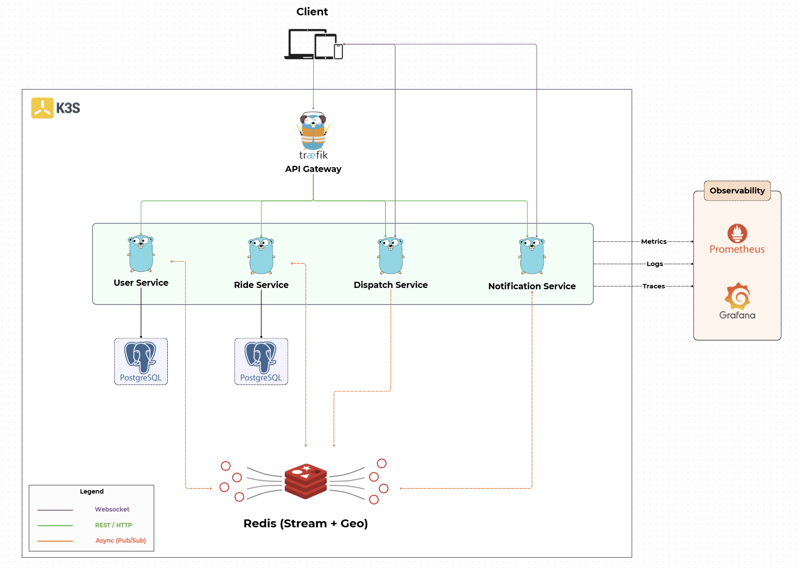
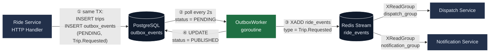
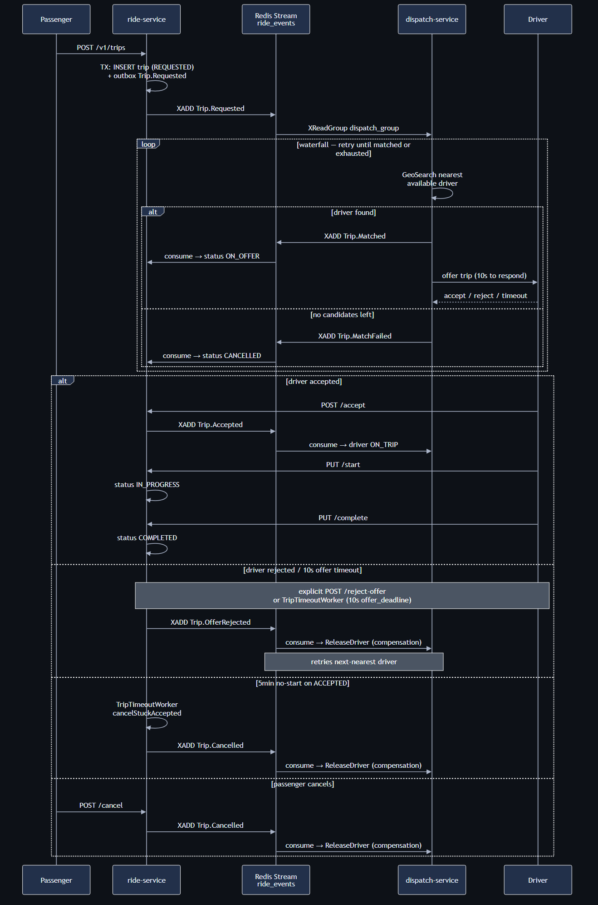
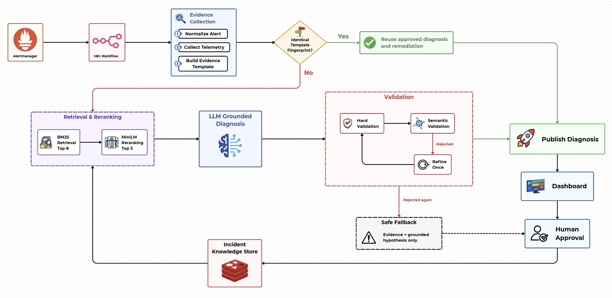
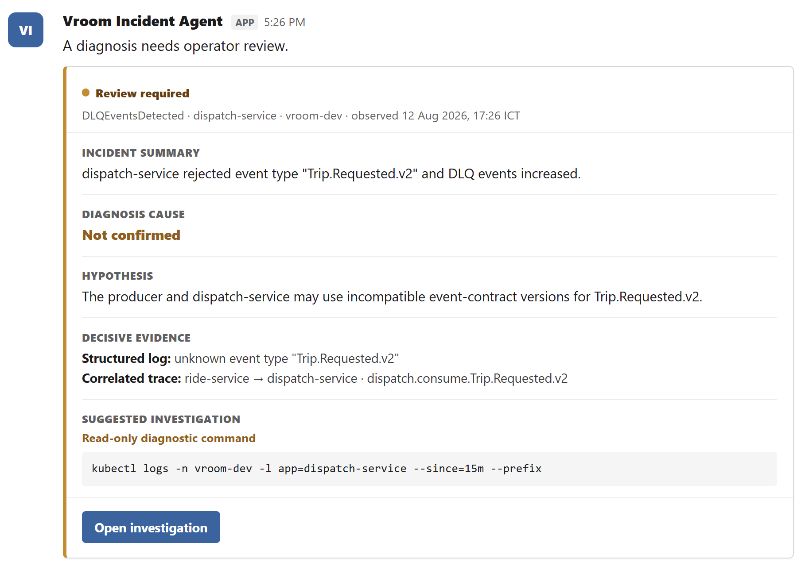
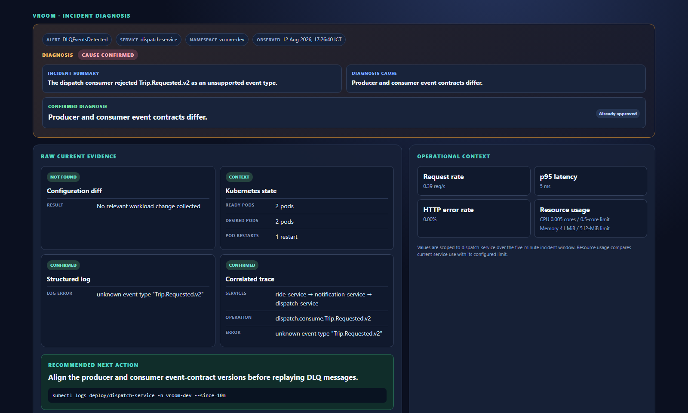
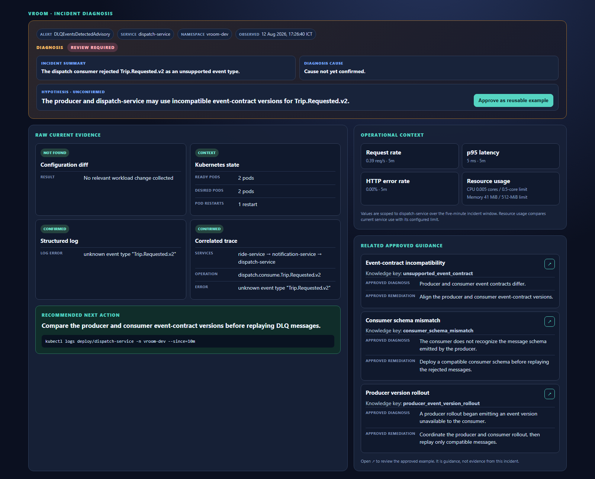
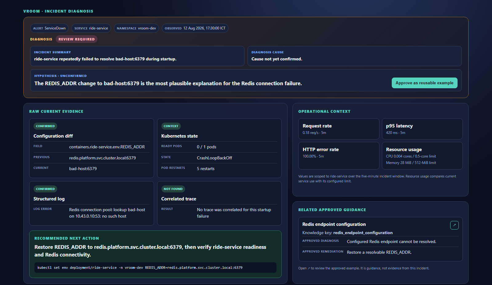

# vroom-services

## About Vroom

**Vroom** is a cloud-native MVP built to explore the full DevOps lifecycle — CI/CD, GitOps, progressive delivery, observability, and AI-assisted incident response — under a hard **12 GB RAM** budget across 3 VMs, running on **K3s** instead of full Kubernetes.

The ride-hailing domain (passengers, drivers, trip matching) is a realistic placeholder application — enough business logic to justify real microservices patterns (event-driven architecture, sagas, the outbox pattern). The actual subject of this project is the platform built around it: how the app is shipped, deployed, observed, and kept alive.

This is a 3-repo GitOps setup, each repo with a single responsibility:

| Repo | Responsibility |
|---|---|
| **vroom-services** (this repo) | Go microservices + Python incident agent + React frontend + CI pipeline |
| [vroom-gitops](https://github.com/Ama2352/vroom-gitops) | Kustomize + ArgoCD + Kargo — CD pipeline environment |
| [vroom-infra](https://github.com/Ama2352/vroom-infra) | Vagrant + Ansible — K3s cluster bootstrap |

## This Repo

The application layer: 4 Go microservices + a React frontend that exercise the patterns described below, plus a Python-based LLM incident-diagnosis agent (`incident-diagnosis/`) and the GitLab CI pipeline that tests, scans, and publishes all of it to GHCR.

---

## Tech Stack

| Category | Technology |
|---|---|
| Language | Go 1.25 |
| Web framework | Gin |
| Frontend | React 19, Vite 8, Axios, react-leaflet (Leaflet 1.9), Framer Motion |
| Database | PostgreSQL 15 (schema-per-service via `search_path`) |
| Messaging | Redis 7 Streams (consumer groups, XAUTOCLAIM, DLQ) |
| DB codegen | SQLC |
| Auth | JWT RS256 |
| Tracing | OpenTelemetry → Tempo (`otelgin`, `otelsql`, `redisotel`) |
| Testing | `go test`, testcontainers (real Postgres + Redis), k6 (load) |
| CI | GitLab CI — test → integration → build → scan (Trivy) → publish (GHCR) |
| SAST | gosec + GitLab SAST |
| Incident agent | Python 3, Flask, Redis-backed approved examples, BM25, MiniLM, guarded LLM generation |

---

## Key Features

- Domain-driven trip state machine (`REQUESTED → ACCEPTED → IN_PROGRESS → COMPLETED`)
- Transactional Outbox — no dual-write between Postgres and Redis Streams
- Saga choreography for driver matching — no orchestrator, compensating transactions on timeout/reject
- Consumer groups + DLQ — at-least-once delivery, XAUTOCLAIM crash recovery, poison-message quarantine
- JWT RS256 auth — asymmetric, only user-service holds the private key
- Redis Geo driver matching — O(log N) radius search, 5 km waterfall
- HPA autoscaling on `ride`/`dispatch`/`user`, verified under k6 load
- End-to-end distributed tracing, including across async Redis Streams hops
- Evidence-first incident diagnosis with exact approved reuse, hybrid advisory retrieval, and human review

---

## Architecture

Four Go microservices communicate through **Redis Streams** using the **Outbox pattern** to guarantee delivery. Driver matching is a **Saga choreography** — no central orchestrator, compensating transactions handle failures.



### Applied patterns

| Pattern | Where | Why |
|---------|-------|-----|
| **Domain-Driven Design** | Each service's `internal/domain/` | Trip state machine + value objects own the business rules |
| **Transactional Outbox** | `ride-service` → Redis Streams | Prevents dual-write: event is committed atomically with the trip row |
| **Saga Choreography** | `ride` ↔ `dispatch` via Redis Streams | No orchestrator process; each service reacts to events and compensates on failure |
| **Consumer Groups + DLQ** | `dispatch_group`, `notification_group` on `ride_events` | At-least-once delivery with XAUTOCLAIM crash recovery; poison messages move to `ride_events_dlq` after 3 retries |
| **Repository pattern** | `internal/repository/` in each service | Isolates DB access; SQLC generates the implementation |
| **JWT RS256** | `user-service` issues; others validate via `JWT_PUBLIC_KEY_PEM` | Asymmetric — only user-service holds the private key |
| **Redis Geo** | `dispatch-service`: `drivers:available` | O(log N) radius search; 5 km waterfall to nearest driver |
| **HPA autoscaling** | `ride`, `dispatch`, `user` (CPU 60%, min=1, max=4) | Scales under load; verified by `validation/load-tests/spike.js` |
| **Distributed tracing** | OTEL → Tempo, all 4 services | `traceparent` propagated through Redis Streams, not just HTTP |
| **Evidence-first diagnosis agent** | `incident-diagnosis/` | Collects logs, correlated traces, Kubernetes state, configuration diffs, and operational context; reuses exact approved examples or produces guarded advisory hypotheses |

### Transactional Outbox

`ride-service` never publishes to Redis from the HTTP handler. Step ① writes the trip row and an `outbox_events` row in the same Postgres transaction, so the event can never be lost even if the process crashes right after `COMMIT`. `OutboxWorker` polls every 2 seconds (②), publishes the pending event to the `ride_events` Redis Stream (③), then marks it `PUBLISHED` (④) — both consumer groups pick it up independently.


```mermaid
flowchart LR
    A["Ride Service<br/>HTTP Handler"] -->|"① same TX:<br/>INSERT trips<br/>INSERT outbox_events<br/>(PENDING, Trip.Requested)"| B[("PostgreSQL<br/>outbox_events")]
    B -->|"② poll every 2s<br/>status = PENDING"| C["OutboxWorker<br/>goroutine"]
    C -->|"③ XADD ride_events<br/>type = Trip.Requested"| D[("Redis Stream<br/>ride_events")]
    C -->|"④ UPDATE<br/>status = PUBLISHED"| B
    D -->|"XReadGroup<br/>dispatch_group"| E["Dispatch Service"]
    D -->|"XReadGroup<br/>notification_group"| F["Notification Service"]

    classDef svc fill:#22304a,stroke:#ffffff,stroke-width:1px,color:#e8eef7
    classDef store fill:#0f1a2b,stroke:#ffffff,stroke-width:1px,color:#e8eef7
    classDef async fill:#1f6f43,stroke:#ffffff,stroke-width:1px,color:#ffffff
    class A,E,F svc
    class B,D store
    class C async
```

### Saga Choreography

Driver matching has no orchestrator — `ride-service` and `dispatch-service` each react to events on the shared `ride_events` stream and publish the next one themselves. Every compensation is explicit about who triggers it: a rejected offer or 10s timeout is detected by `ride-service` (`TripTimeoutWorker` or `POST /reject-offer`), which publishes `Trip.OfferRejected`; `dispatch-service` consumes it, releases the driver, and the waterfall loop retries the next-nearest candidate.

This is a static image rather than a live Mermaid block — sequence-diagram message/loop text renders on a transparent canvas with no background box behind it, so a color scheme readable in GitHub's light mode goes invisible in dark mode (and vice versa). Baking the render in as an image avoids that.



---

## SRE Incident Diagnosis Agent

### Evidence-first diagnosis

Vroom turns an Alertmanager notification into a structured investigation rather
than treating the alert as a root-cause statement. For the affected workload,
the agent gathers current logs, a correlated trace when available, Kubernetes
state and events, safe workload configuration diffs, and operational context.
That evidence remains visible so an operator can verify the result instead of
trusting generated text alone.

The agent recognizes known failures without confusing similarity for proof. An
identical human-approved example reuses its approved diagnosis and remediation.
Otherwise, BM25 and MiniLM retrieve related guidance and the LLM produces a
grounded, explicitly unconfirmed hypothesis. Hard and semantic guardrails
validate non-exact output, with one refinement at most; an unsupported cause is
withheld while the current evidence and any cited hypothesis remain available.



Metrics describe impact rather than cause. A selected structured log can bridge
to an agreeing trace, while missing telemetry remains missing rather than being
treated as a healthy zero. The agent recommends safe next actions but never
executes remediation; a reviewer owns promotion of an incident into reusable
knowledge.

- **Current evidence:** scoped logs, correlated trace facts, Kubernetes state
  and events, safe configuration diffs, and operational metrics are retained.
- **Hybrid retrieval:** BM25 provides lexical recall; MiniLM semantically
  reranks approved examples.
- **Guarded generation:** advisory output must cite current evidence and pass
  hard and semantic validation before it is published.
- **Human control:** the agent recommends next actions but never executes a
  remediation; a reviewer approves reusable examples and knowledge.

n8n also sends a compact Slack advisory for quick operator awareness. It
contains the incident summary, an explicitly unconfirmed diagnosis cause,
grounded hypothesis, decisive evidence, and a read-only investigation command;
the dashboard remains the full evidence surface.



### Verified scenarios

#### DLQ contract mismatch — exact reuse

`DLQEventsDetected` for `dispatch-service` captures an unsupported
`Trip.Requested.v2` structured error and agreeing cross-service trace. Its
complete normalized evidence matches an approved reusable example, so the
agent confirms the producer/consumer contract mismatch without an LLM call.



#### DLQ contract mismatch — advisory diagnosis

The same `dispatch-service` failure family can arrive with a non-identical
evidence fingerprint. The structured error and correlated trace are retained;
related approved examples guide an unconfirmed contract-version hypothesis,
but do not establish a confirmed cause.



#### Redis endpoint configuration failure

For `ServiceDown` on `ride-service`, the dashboard connects the previous and
current `REDIS_ADDR` values with the Redis name-resolution error and pod state.
The configuration change is a grounded hypothesis for review, not automatic
causal attribution.



**[Read the incident diagnosis architecture, retrieval design, and guardrails →](docs/incident-diagnosis-agent.md)**

---

## Repository Layout

```
vroom-services/
├── services/                    Application code
│   ├── user/                    Identity — JWT RS256, user CRUD
│   │   ├── internal/
│   │   │   ├── domain/          User entity, value objects
│   │   │   ├── handler/         Gin HTTP handlers
│   │   │   ├── repository/      DB interface + SQLC postgres impl
│   │   │   └── service/         Business logic
│   │   ├── migrations/          golang-migrate SQL files
│   │   ├── sqlc.yaml            SQLC config
│   │   └── Dockerfile.dev       Alpine + Air hot-reload
│   ├── ride/                    Trip lifecycle — Outbox publisher, Saga participant
│   │   └── internal/
│   │       ├── domain/          Trip entity + state machine (REQUESTED→COMPLETED)
│   │       ├── worker/          OutboxWorker (polls → XADD), TripTimeoutWorker
│   │       └── integration/     testcontainers integration tests
│   ├── dispatch/                 Driver matching — Saga coordinator, Redis Geo
│   │   └── internal/
│   │       ├── domain/          DriverState (AVAILABLE / ON_OFFER / ON_TRIP)
│   │       └── worker/          Redis Streams XReadGroup consumer, DLQ handling
│   ├── notification/             Event fan-out — WebSocket push, XAUTOCLAIM + DLQ
│   ├── frontend/                 React 19 + Vite (passenger + driver UIs)
│   └── tests/                    Cross-service choreography integration tests
├── incident-diagnosis/           SRE incident diagnosis agent (deployed as "incident-agent")
│   ├── agent/                    Evidence collection, retrieval, grounded generation, validation, and incident APIs
│   └── kubectl-executor/         Allowlist-gated kubectl HTTP gateway for operator-controlled access
├── validation/                   Things that exercise a running deployed cluster
│   ├── load-tests/               k6 scenarios — baseline (P95<500ms), spike, geo_flood
│   └── demo/                     Chaos/resilience demo scripts (pod crash, consumer crash, DLQ)
├── local/
│   └── init-db.sql               Bootstrap DB users + schemas for docker-compose
├── docs/images/                   README diagrams
├── docker-compose.yml             Full local stack (Postgres + Redis + all services + frontend)
└── README.md
```

Each Go service follows the same internal layout — see `services/ride/internal/` above for the canonical structure.

---

## Quick Start (local, no Kubernetes needed)

```bash
# Full stack with hot reload
docker-compose up --build

# User:         http://localhost:8081
# Ride:         http://localhost:8082
# Dispatch:     http://localhost:8083
# Notification: http://localhost:8084
# Frontend:     http://localhost:5173
```

```bash
# Single service (fastest iteration)
docker-compose up postgres redis -d
cd services/ride
PORT=8082 go run ./...
```

```bash
# Tests
cd services/ride
go test ./... -v
go test ./internal/integration/... -tags integration -v   # requires Docker
```

---

## CI/CD Pipeline

GitLab CI only builds and publishes — it never touches `vroom-gitops`. Delivery from there is owned end-to-end by Kargo, which polls GHCR directly and promotes through three gated environments:

```
Developer pushes to main
        │
        ▼
GitLab CI (this repo)
  ├── test         go test per service + gosec + GitLab SAST
  ├── integration  testcontainers (real Postgres + Redis) — outbox, saga, geo matching
  ├── build        Docker multi-stage build → .tar artifact, per service
  ├── scan         Trivy image scan (HIGH/CRITICAL, SARIF report)
  └── publish      Push to GHCR (ghcr.io/ama2352/vroom-mvp-*)
        │
        ▼
Kargo Warehouse (vroom-gitops) polls GHCR for new tags → creates Freight
        │
        ▼
  dev        auto-promote as soon as Freight appears
        │    verified by prometheus-checks (error rate, P95 latency, OOMKill)
        ▼
  staging    auto-promote once dev's Freight is verified
        │    verified by prometheus-checks
        ▼
  prod       requires human approval (`kargo approve`)
             verified by prometheus-checks
```

| Stage | What runs | Notes |
|-------|-----------|-------|
| `test` | `go test ./...` per service + `gosec` SAST + GitLab SAST template | `ride`/`dispatch` block the pipeline on failure; `user`/`notification` are `allow_failure: true` |
| `integration` | testcontainers-backed tests behind `-tags integration` | Real Postgres + Redis via `docker:dind`; covers outbox atomicity, saga compensation, geo matching, cross-service choreography |
| `build` | Docker multi-stage build → `.tar` artifact | Per-service jobs for `user`/`ride`/`dispatch`/`notification`/`frontend` |
| `scan` | Trivy image scan on the `.tar` artifact | HIGH/CRITICAL, SARIF report, non-blocking |
| `publish` | Push to GHCR (`ghcr.io/ama2352/vroom-mvp-*`) | Tags: `latest`, semver, short SHA. `incident-diagnosis/*` build+push in one combined job (Python images exceed GitLab's artifact upload limit as `.tar`, so they skip `build`/`scan` and publish directly) |

Everything after `publish` — dev/staging/prod promotion, verification, approval — lives in [vroom-gitops](https://github.com/Ama2352/vroom-gitops) (`delivery/`), not here.

Required CI variables (GitLab Settings → CI/CD → Variables):

| Variable | Purpose |
|----------|---------|
| `GHCR_USER` | GitHub username |
| `GHCR_TOKEN` | GitHub PAT with `write:packages` scope |
| `GITHUB_GITOPS_TOKEN` | Classic PAT with `repo` scope — used by Kargo, not CI, to push promoted overlays to vroom-gitops |
