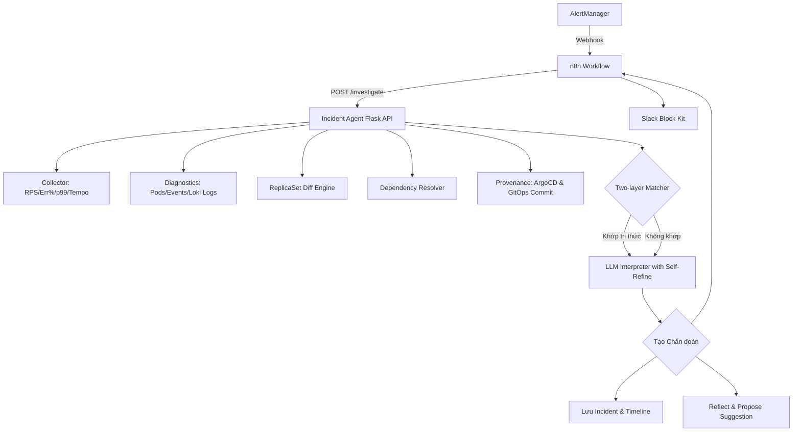
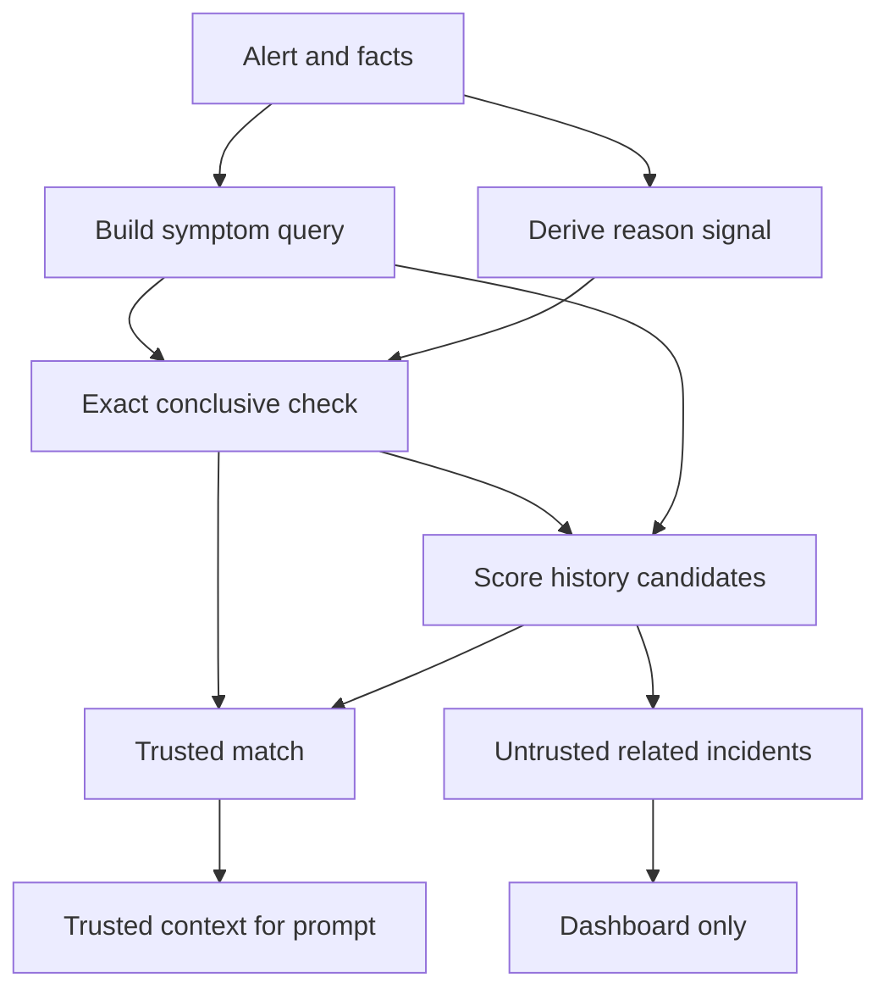
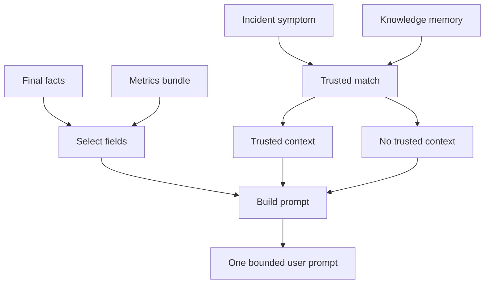
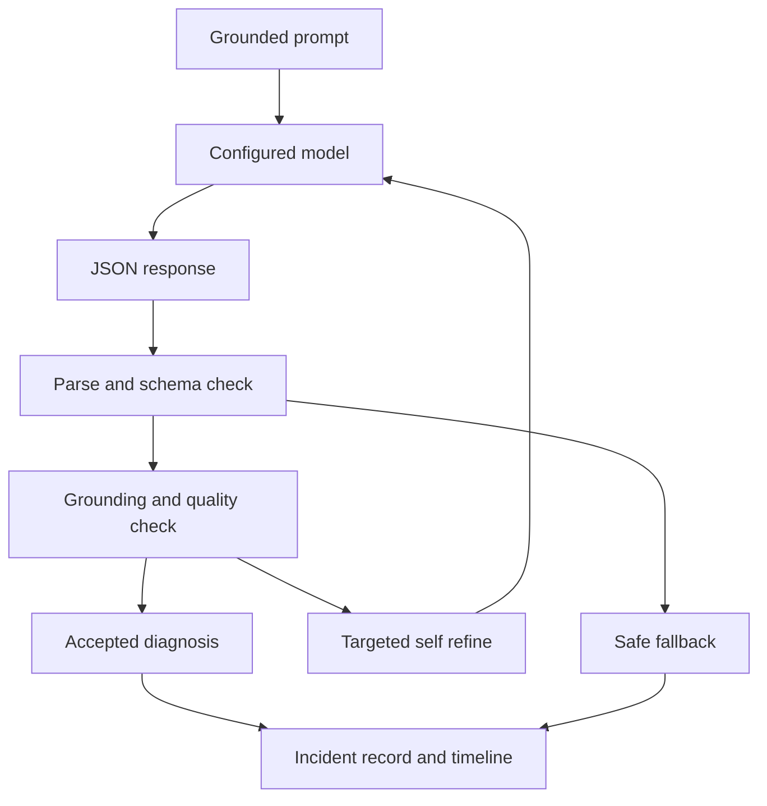
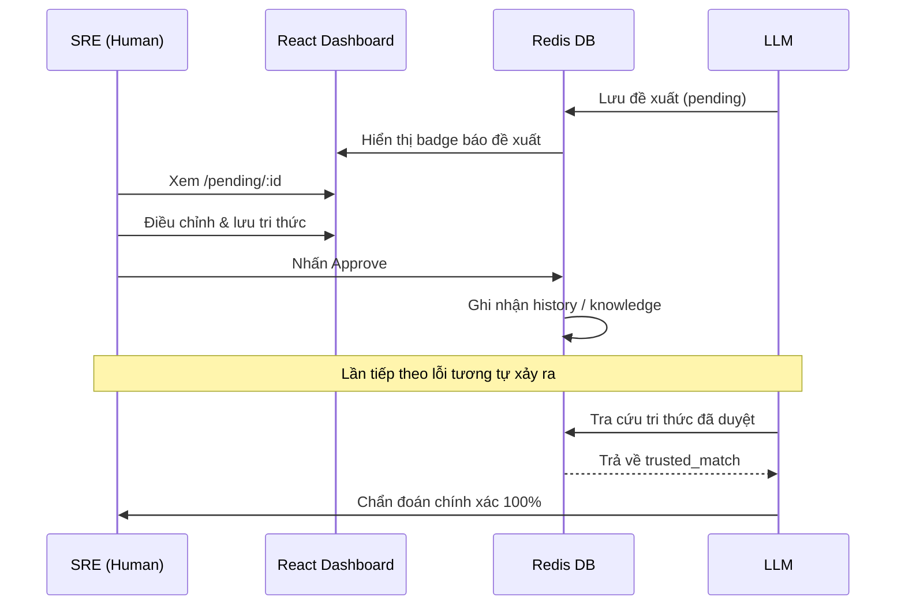

# Incident Diagnosis Agent: Quy trình & Tình huống Vận hành

Tài liệu mô tả chi tiết kiến trúc, quy trình thu thập dữ liệu tự động, cơ chế đối khớp tri thức, lập luận LLM và quy trình học máy tự động (Human-in-the-loop) thuộc hệ thống Vroom.

---

## Mục lục (Table of Contents)
1. [Tổng quan & Kiến trúc (Overview & Architecture)](#1-tổng-quan--kiến-trúc-overview--architecture)
2. [Quy trình Pipeline Chẩn đoán Chi tiết (Pipeline Detail)](#2-quy-trình-pipeline-chẩn-đoán-chi-tiết-pipeline-detail)
3. [Thu thập Evidence & Ưu tiên (Evidence & Priority)](#3-thu-thập-evidence--ưu-tiên-evidence--priority)
4. [R - Retrieval: Chọn Tri thức Tin cậy (R - Retrieval)](#4-r---retrieval-chọn-tri-thức-tin-cậy-r---retrieval)
5. [A - Augmentation: Dựng Context Có Giới hạn (A - Augmentation)](#5-a---augmentation-dựng-context-có-giới-hạn-a---augmentation)
6. [G - Generation: Diễn giải, Kiểm tra & Ghi nhận (G - Generation)](#6-g---generation-diễn-giải-kiểm-tra--ghi-nhận-g---generation)
7. [Cơ chế Học máy Vận hành (SRE Feedback Loop)](#7-cơ-chế-học-máy-vận-hành-sre-feedback-loop)
8. [Tình huống Thực tế (Use Cases)](#8-tình-huống-thực-tế-use-cases)

---

## 1. Tổng quan & Kiến trúc (Overview & Architecture)

Incident Diagnosis Agent hoạt động như một hệ thống chẩn đoán tự động cho Kubernetes cluster. Thay vì để LLM tự thực hiện các lệnh shell hoặc truy vấn trực tiếp (dễ gây lỗi bảo mật hoặc ảo giác cú pháp), hệ thống chia làm hai lớp rõ rệt:

* **Lớp Thu thập Dữ liệu (Python Engines):** Thực hiện truy vấn Kubernetes APIs, Prometheus, Loki và Tempo để thu thập thông tin có cấu trúc sạch.
* **Lớp Lập luận (LLM Reasoning with Self-Refinement):** Nhận dữ liệu chuẩn hóa, đối khớp tri thức lịch sử và thực hiện suy luận có kiểm chứng (grounding check) để rút ra chẩn đoán lỗi kèm câu lệnh khắc phục.

> **Lợi ích cốt lõi:** Ngăn chặn hoàn toàn lỗi phân tích cú pháp bảng biểu thô ở các mô hình LLM nhỏ, đồng thời tăng tính an toàn hệ thống do loại bỏ khả năng LLM tự ý sinh lệnh phá hoại cluster.



### 2. Các Thành phần Công nghệ (Technology Stack)

* **Flask API (Python):** Cung cấp các endpoint vận hành chính bao gồm `/investigate`, `/incidents`, `/pending`, và `/knowledge`.
* **Redis Database:** Lưu trữ cơ sở tri thức (Knowledge), lịch sử phê duyệt sự cố (History), các sự cố đang mở (Open Incidents), timeline của từng sự cố và các đề xuất đang chờ duyệt (Pending Suggestions).
* **LLM Provider (Groq / OpenRouter):** Sử dụng các mô hình ngôn ngữ lớn (mặc định là Llama 3.3 70B và Llama 3.1 8B) để lập luận và tổng hợp đề xuất cập nhật tri thức.

### 3. Quyết định Thiết kế & Trade-offs SRE/RAG

| Quyết định | Lý do theo nghiệp vụ | Trade-off được chấp nhận |
| --- | --- | --- |
| Evidence có cấu trúc trước RAG | Kubernetes state, metrics, events, ReplicaSet diff và dependency health là nguồn sự thật có kiểu dữ liệu rõ ràng; chúng được thu thập trực tiếp thay vì embedding. | Ít “linh hoạt” hơn một agent hội thoại tự do, nhưng giảm suy diễn sai về trạng thái cluster. |
| Exact match cho tín hiệu K8s conclusive | `OOMKilled` hoặc `CreateContainerConfigError` là trạng thái chuẩn hóa, có giá trị chẩn đoán cao; khớp chính xác cho độ chính xác và tính an toàn tốt nhất. | Chỉ bao phủ các failure mode đã biết; các lỗi mơ hồ vẫn phải dựa vào evidence và LLM. |
| Token coverage là trust gate hiện tại | History do SRE phê duyệt chỉ trở thành trusted context khi triệu chứng hiện tại có đủ token chung; ngưỡng `0.5` là chính sách bảo thủ để tránh đưa tiền lệ yếu vào chẩn đoán. | Ngưỡng chưa được hiệu chỉnh bằng benchmark; có thể bỏ lỡ các cách diễn đạt tương đương nhưng ít token trùng nhau. |
| BM25 cho tiền lệ không xác nhận | Logs SRE thường chứa hostname, port, error code và K8s reason lặp lại theo nghĩa đen. Với corpus nhỏ và giới hạn pod 400 MiB, BM25 nhẹ hơn dense embedding và dễ giải thích hơn. | BM25 không hiểu paraphrase không có token chung; kết quả chỉ là *candidate precedent*, không phải bằng chứng root cause. |
| Service là metadata, không phải relevance token | Root cause có thể lặp lại giữa nhiều service. Không đưa tên service vào điểm lexical giúp tránh incident cùng service nhưng khác nguyên nhân vượt lên incident đúng ở service khác. | Cần dùng namespace/service như bộ lọc hoặc ngữ cảnh hiển thị khi nghiệp vụ yêu cầu, thay vì coi chúng là bằng chứng nhân quả. |
| Grounded generation có deterministic guardrails | LLM tổng hợp và giải thích evidence, nhưng JSON schema, grounding check, phát hiện câu trả lời chung chung và self-refinement giới hạn các khẳng định không được hỗ trợ. | Đôi khi trả lời low-confidence hoặc ngắn thay vì đoán nguyên nhân; đây là hành vi mong muốn trong incident response. |
| Human-in-the-loop, recommendation-only | Agent đề xuất lệnh và cập nhật knowledge, còn SRE phê duyệt trước khi tri thức được tin cậy hoặc trước khi operator thực hiện remediation. | Không tự động giảm MTTR bằng remediation tự trị, đổi lại tránh mutation không an toàn trên cluster. |


---

## 2. Quy trình Pipeline Chẩn đoán Chi tiết (Pipeline Detail)

### 1. Kích hoạt & Tiếp nhận (Trigger & Ingestion)
Khi AlertManager phát hiện lỗi (ví dụ: `ServiceDown`), nó gửi webhook cảnh báo đến workflow n8n với payload chứa danh sách cảnh báo. Ví dụ:

```json
{
  "status": "firing",
  "commonLabels": {
    "alertname": "ServiceDown",
    "service": "ride-service",
    "namespace": "vroom-dev"
  }
}
```

Hệ thống n8n phân tách và chuẩn hóa payload này thành các trường tương ứng để gọi endpoint `POST /investigate` của Incident Agent:

```json
POST /investigate
{
  "alert_name": "ServiceDown",
  "service": "ride-service",
  "namespace": "vroom-dev"
}
```

### 2. Thu thập Dữ liệu Phụ trợ (Structured Ingestion)
Agent thực thi song song các tiến trình thu thập thông tin để tạo bức tranh toàn cảnh:

* **1. Metrics Bundle (collector.py):** Thu thập các thông số vận hành cơ bản trong 5 phút gần nhất:
  * **RPS:** Tốc độ request trung bình.
  * **Error Rate:** Tỷ lệ request lỗi 5xx.
  * **Latency p99:** Độ trễ phân vị thứ 99.
  * **Loki Errors Count:** Số lỗi tìm thấy trong logs.
  * **Tempo Traces:** Phát hiện vết trace bị lỗi.
* **2. Kubernetes Diagnostics (diagnostics.py):** Lấy trạng thái thực tế của tài nguyên trong namespace:
  * Replicas thực tế so với cấu hình mong muốn (Available vs Desired).
  * Trạng thái Container (Waiting reason: `OOMKilled`, `CrashLoopBackOff`, v.v.).
  * Trạng thái Init Container (lý do thoát, số lần restart).
  * Logs lỗi mẫu từ Loki & Sự kiện Warning từ K8s Events API.

### 3. Phân tích Khác biệt & Liên kết (Diff & Dependency Chase)
Agent chạy các giải thuật phụ trợ để làm rõ nguyên nhân sâu xa:

* **ReplicaSet Diff Engine:** So sánh cấu hình (image tag, biến môi trường) của 2 ReplicaSet gần nhất. Nếu phát hiện thay đổi, trích xuất mốc thời gian cập nhật của Deployment để làm cơ sở đối sánh.
* **Dependency Resolver:** Trích xuất IP:port từ log lỗi hoặc event message (ví dụ: `10.43.68.150:5432`). Phân giải IP này sang Kubernetes Service tương ứng (ví dụ: `postgres`) và kiểm tra sức khỏe hiện tại của service phụ thuộc đó.
* **Provenance Tracker (GitOps vs Manual Hotfix):** Truy vấn ArgoCD sync status. Nếu ứng dụng ở trạng thái `OutOfSync`, sự cố được gán nhãn là `hotfix` (chỉnh sửa thủ công trực tiếp trên cluster). Nếu `Synced`, Agent gọi GitHub API để truy vết commit GitOps gần nhất thay đổi file cấu hình, kèm theo thông tin tác giả, nội dung commit, và Pull Request liên quan.

### 4. Đối khớp Tri thức Đáng tin cậy (Two-layer Trusted Matching)
Để tăng tốc chẩn đoán và loại bỏ ảo giác của LLM, Agent thực hiện đối khớp tri thức trong Redis:

* **Layer 1: Exact-match Trusted Grounding:** Đối với các lỗi conclusive (chắc chắn do một nguyên nhân, ví dụ: `OOMKilled`, `CreateContainerConfigError`), Agent ánh xạ trực tiếp đến tri thức đã được phê duyệt. Tri thức này được đưa vào prompt như một cơ sở đáng tin cậy; LLM vẫn tổng hợp đầu ra và phải qua deterministic quality check.
* **Layer 2: Token-coverage Matching:** Đối với các lỗi không conclusive (ví dụ: `CrashLoopBackOff` do lỗi kết nối), Agent tính toán độ trùng khớp từ khóa giữa triệu chứng hiện tại với các bản ghi sự cố lịch sử đã phê duyệt (history entries):
  `Score = |tokens(query) ∩ tokens(symptom)| / |tokens(query)|`
  Nếu điểm số cao nhất vượt ngưỡng `0.5`, Agent trích xuất tri thức đã lưu làm cơ sở lập luận đáng tin cậy cho bước tiếp theo.

### 5. Lập luận có Kiểm chứng & Tự sửa lỗi (LLM Reasoning & Self-Refine)
Sau khi Retrieval hoàn tất, Agent luôn gửi evidence hiện tại vào LLM Interpreter. Nếu có trusted match ở Layer 1 hoặc Layer 2, match đó được thêm làm context đã được phê duyệt; nó không bỏ qua bước LLM reasoning.

* **Giai đoạn 1: Grounded Generation:** LLM sinh ra phân tích lỗi thô dựa trên quy tắc: chỉ khẳng định các luận điểm được hỗ trợ trực tiếp bởi bằng chứng kỹ thuật.
* **Giai đoạn 2: Deterministic Quality Check:** Bộ kiểm định Python quét đầu ra của LLM:
  * Kiểm tra cấu trúc JSON hợp lệ và các trường bắt buộc (`root_cause`, `dev_action`, `kubectl_hint`).
  * Phát hiện và thay thế các placeholder (dạng `<pod>`) bằng tên pod thực tế hoặc nhãn nhắm mục tiêu.
  * Xác thực tính xác thực (Grounding check): Từ khóa chính trong nguyên nhân cốt lõi phải xuất hiện trong log lỗi hoặc event message thực tế.
  * Lọc bỏ các mô tả chung chung vô nghĩa (nằm trong danh sách blacklist như "potential issue", "check the logs").
* **Giai đoạn 3: Targeted Self-Refine:** Nếu phát hiện vi phạm ở Giai đoạn 2, Agent lập tức thực hiện truy vấn LLM lần 2, truyền vào lỗi cũ kèm danh sách các điểm vi phạm cụ thể để LLM tự sửa đổi cấu trúc. Nếu vẫn thất bại, Agent áp dụng cơ chế fallback an toàn là sử dụng template chẩn đoán chuẩn.

### 6. Lưu trữ sự cố & Khởi chạy Vòng lặp Học máy (Persistence & Learning Loop)
Agent lưu thông tin sự cố vào Redis. Nếu phát hiện sự cố trùng lặp trên cùng một service và alert, Agent tự động gộp vào sự cố hiện có và cập nhật dòng sự kiện (incident timeline). 

Đồng thời, một luồng xử lý nền (`_reflect_and_store`) được kích hoạt để phân tích sự cố đã giải quyết, đề xuất một khóa tri thức nháp ở dạng `pending:suggestion` để SRE kiểm duyệt trên dashboard.

---

## 3. Thu thập Evidence & Ưu tiên (Evidence & Priority)

Agent không gửi toàn bộ raw telemetry cho LLM. Mỗi nguồn được thu thập vì nó trả lời một câu hỏi khác nhau: Kubernetes cho biết **đang hỏng ở trạng thái nào**, log thường cho biết **đã xảy ra lỗi gì**, metrics xác nhận **mức độ ảnh hưởng**, còn trace chỉ hữu ích khi cần lần theo một request qua nhiều service.

### Quy trình Evidence
1. **Collect:** Prometheus, Loki, Kubernetes Events, ReplicaSet và Tempo trả về dữ liệu thô.
2. **Normalize:** Backend chuyển chúng thành các facts có tên, kiểu và ý nghĩa ổn định.
3. **Route:** Một số field dùng để query, một số làm evidence cho LLM, số khác chỉ để hiển thị/audit.
4. **Diagnose:** LLM nhận context ngắn, có cấu trúc và được kiểm tra grounding trước khi lưu kết quả.

### Field glossary · Ý nghĩa của từng field

| Field | Nguồn | Ý nghĩa | Mục đích thu thập | Query / match | LLM | UI / audit |
| --- | --- | --- | --- | --- | --- | --- |
| `alert_name` | Prometheus alert | Tên rule cảnh báo, ví dụ `ServiceDown`. | Cho biết loại triệu chứng ban đầu và nhóm lịch sử tương tự. | Có | Có | Có |
| `service` | Alert / routing | Workload hoặc service bị ảnh hưởng. | Chọn label Prometheus, Loki, Deployment và phạm vi điều tra. | Không | Có | Có |
| `namespace` | Alert / Kubernetes | Namespace chứa workload. | Tránh query nhầm service cùng tên ở namespace khác. | Có, để scope | Có | Có |
| `pod` | Alert | Pod cụ thể nếu alert có label pod. | Giúp chọn đúng pod khi cần xem log hoặc tạo kubectl hint. | Không | Có nếu có giá trị | Có |
| `pods_available` / `pods_desired` | kube-state-metrics | Số replica đang available so với số replica Deployment mong muốn. | Phát hiện thiếu replica hoặc `ZeroReplicas`. | Có | Có | Có |
| `pods_running` / `pods_ready` | kube-state-metrics | Số pod đang chạy và số pod đã sẵn sàng nhận traffic. | Phân biệt “pod còn chạy” với “service thực sự ready”. | Không | Có | Có |
| `waiting_reason` | kube-state-metrics | Lý do container **hiện tại** đang ở trạng thái Waiting, ví dụ `CrashLoopBackOff`, `ImagePullBackOff` hoặc `CreateContainerConfigError`. | Đây là Kubernetes reason signal trực tiếp và thường có tính chẩn đoán cao. | Có | Có | Có |
| `last_terminated_reason` | kube-state-metrics | Lý do container kết thúc ở lần chạy gần nhất, ví dụ `OOMKilled` hoặc `Error`. | Giải thích nguyên nhân của lần crash trước, kể cả khi container đã restart. | Có | Có | Có |
| `restarts` | kube-state-metrics | Số lần container đã restart. | Đo mức độ lặp lại của failure và hỗ trợ diễn giải CrashLoop. | Không | Có | Có |
| `init_waiting_reason` / `init_last_terminated_reason` | kube-state-metrics | Trạng thái hoặc lý do thoát của init container. | Phát hiện lỗi xảy ra trước khi main container khởi động. | Có | Có | Có |
| `init_restarts` | kube-state-metrics | Số lần init container restart. | Cho biết init failure có lặp lại hay không. | Không | Có | Có |
| `log_error` | Loki | Dòng log lỗi gần nhất, gồm các pattern như error, failed, refused, fatal. | Thường là bằng chứng cụ thể nhất về hostname, port, dependency hoặc error code. | Có | Có | Có |
| `event_reason` | Kubernetes Events | Reason của Warning event mới nhất. | Bổ sung nguyên nhân control-plane như BackOff, FailedScheduling hoặc FailedMount. | Có | Có | Có |
| `event_message` / `event_object` | Kubernetes Events | Nội dung event và object bị ảnh hưởng. | Giúp grounding và xác định resource mà event nói tới. | Không | Có | Có |
| `template_diff` | ReplicaSet / GitOps | Thay đổi image, environment hoặc deployment template giữa các phiên bản. | Tìm quan hệ thời gian giữa deploy/hotfix và incident. | Không | Có | Có |
| `dependency` | Loki + Kubernetes | Dependency được suy ra từ lỗi IP:port và trạng thái pod của dependency đó. | Phân biệt service hỏng với dependency hỏng. | Có | Có | Có |
| `rps` | Prometheus | Request trung bình mỗi giây trong khoảng 5 phút. | Đặt error/latency vào bối cảnh traffic. | Không | Có, dạng summary | Có |
| `err` | Prometheus | Tỷ lệ request HTTP 5xx trong khoảng 5 phút. | Xác nhận mức độ ảnh hưởng, nhưng không tự nói ra root cause. | Không | Có, dạng summary | Có |
| `p99` | Prometheus | Ngưỡng latency mà 99% request nằm dưới trong khoảng 5 phút. | Phát hiện degradation và hỗ trợ phân biệt lỗi nhanh/chậm. | Không | Có, dạng summary | Có |
| `loki_errors` | Loki | Số stream kết quả có log lỗi trong cửa sổ truy vấn. | Tóm tắt rằng log errors có xuất hiện. | Không | Có, dạng summary | Có |
| `traces_errored` / `trace_sample` | Tempo | Số trace có error và tên root trace mẫu trong cửa sổ gần đây. | Tín hiệu phụ cho cross-service/latency investigation; hiện chưa phải span-level evidence. | Không | Có, summary hiện tại | Có |
| `memory_context` | Redis knowledge base | Failure pattern đã được SRE xác nhận. | Tái sử dụng pattern đáng tin cậy khi facts hiện tại khớp. | Kết quả sau retrieval | Có nếu trusted | Có |
| `provenance` | ArgoCD / GitOps | Nguồn thay đổi: commit, PR, drift hoặc manual hotfix. | Giải thích nguồn gốc thay đổi và phục vụ audit. | Không | Không trong prompt hiện tại | Có |


### Vì sao chỉ một số field vào LLM?
* Raw Prometheus, Loki, Tempo và `kubectl` response quá dài, không ổn định và nhiều noise.
* Field dùng để query chỉ cần tạo symptom hoặc reason signal; không cần lặp lại toàn bộ logic query trong prompt.
* Field UI/audit vẫn được lưu để operator kiểm tra, nhưng không nhất thiết giúp model suy luận root cause.
* Prompt ngắn và có cấu trúc giúp giảm token cost, giảm hallucination và làm grounding check đáng tin cậy hơn.
* LLM nhận condensed metrics bundle, không nhận raw time series hoặc toàn bộ trace tree.

### Thứ tự ưu tiên chẩn đoán
1. **Kubernetes state/events:** sự thật trực tiếp từ control plane, có reason và action rõ.
2. **Deployment/config change:** bằng chứng nhân quả mạnh nếu xảy ra gần thời điểm incident.
3. **Error logs:** thường chứa hostname, port, error code hoặc dependency cụ thể.
4. **Metrics:** xác nhận symptom, severity, traffic và latency; thường không tự giải thích nguyên nhân.
5. **Traces:** hữu ích cho cross-service/latency, nhưng hiện chỉ được thu thập ở mức summary.

> **Lưu ý:** “Ưu tiên” không có nghĩa là metrics hoặc traces vô dụng. Nó nghĩa là evidence ở trên thường có tính nhân quả, actionability và độ tin cậy cao hơn cho automated diagnosis.

### AlertManager, Redis Stream và tracing hiện tại
* **Alert name:** DevOps đặt tên rule trong field `alert:` của Prometheus values, ví dụ `ServiceDown` hoặc `KubernetesPodNotReady`. AlertManager nhận tên này dưới label `alertname` để group và route.
* **Event-stream errors:** Các rule hiện tại bắt pod crash, readiness, service down và một số node condition; chưa có rule trực tiếp cho Redis consumer lag, pending entries hoặc DLQ counter. Vì vậy consumer có thể lỗi nhưng pod vẫn healthy mà không tạo incident.
* **Trace depth:** Trace context được truyền qua Redis bằng `traceparent`, nhưng agent hiện không nhận trace ID từ alert và không dựng span tree. Tempo hiện chỉ đóng vai trò summary; deep trace cần operator hoặc một collector giàu span hơn.

> **Gợi ý mở rộng:** Muốn phát hiện đầy đủ lỗi event stream, cần bổ sung alert cho consumer lag, số message pending, processing error counter và DLQ events. Muốn agent trace sâu, cần thu thập trace ID/span lỗi, exception attributes, service boundary và duration breakdown rồi đưa chúng vào evidence model.

---

## 4. R - Retrieval: Chọn Tri thức Tin cậy (R - Retrieval)

Retrieval không tìm kiếm trên raw logs. Backend bắt đầu từ alert và object `facts` đã được chuẩn hóa, tạo một symptom query và một K8s reason signal, sau đó quyết định liệu Redis có thể cung cấp một trusted failure pattern hay không.

### Các thành phần đầu vào
1. **Triệu chứng để tìm kiếm (Symptom query):** `build_symptom_text()` ghép alert name, main-container waiting reason và lỗi Loki mới nhất. Đây là query dùng để chấm token coverage với history.
   * `alert_name`
   * `waiting_reason`
   * `log_error`
   * Ví dụ: `KubernetesPodCrashLooping`, `CrashLoopBackOff`, `dial tcp: connection refused`
2. **Tín hiệu K8s chuẩn hóa (Reason signal):** `_derive_reason_signal()` chọn một signal duy nhất theo thứ tự ưu tiên. Signal cụ thể nhất được dùng cho exact trusted match.
   * `init last exit` -> `init waiting` -> `last exit` -> `waiting reason` -> `ZeroReplicas` -> `dependency health` -> `event reason`
3. **Context cho LLM hoặc dashboard (Trusted result):** Knowledge entry chỉ trở thành trusted context khi exact conclusive match hoặc token-coverage score đạt ngưỡng. Các related incident chưa trusted chỉ hiện trên dashboard.
   * `source`, `knowledge_key`, `root_cause_pattern`, `fix_action`, `context_notes`

### Luồng Retrieval



* **Exact match:** Nếu `trigger_waiting_reason` của knowledge entry bằng signal hiện tại và entry có `conclusive=true`, Agent trả về pattern đó ngay như trusted context.
* **Token coverage:** Với history hoặc non-conclusive knowledge, Agent tính tỷ lệ token query xuất hiện trong symptom. Candidate cao nhất phải đạt ngưỡng `0.5` mới trở thành trusted match.

### Object facts cuối cùng trước bước LLM

```json
alert_name
waiting_reason
log_error

KubernetesPodCrashLooping
CrashLoopBackOff
dial tcp: connection refused
```

### Tất cả field thu thập và vai trò trong Retrieval

| Nguồn | Field | Ý nghĩa | Dùng trong Retrieval |
| --- | --- | --- | --- |
| Alert | `alert_name` | Tên rule cảnh báo, ví dụ `ServiceDown`. | Có - symptom query |
| Alert | `service`, `namespace`, `pod` | Định danh workload và pod cụ thể nếu alert cung cấp. | Không - dùng cho collection/prompt |
| Metrics bundle | `rps`, `err`, `p99` | Lưu lượng, tỷ lệ 5xx và P99 trong cửa sổ 5 phút. | Không - chỉ prompt |
| Metrics bundle | `loki_errors`, `traces_errored`, `trace_sample` | Số log/traces lỗi và tên một trace mẫu khi có. | Không - chỉ prompt |
| Pod health | `pods_available`, `pods_desired` | Replica available so với replica mong muốn. | Có - suy ra `ZeroReplicas` |
| Pod health | `pods_running`, `pods_ready` | Replica đang chạy và ready. | Không - lưu/dashboard |
| Main container | `waiting_reason` | Trạng thái chờ hiện tại, ví dụ `CrashLoopBackOff`. | Có - query và reason signal |
| Main container | `last_terminated_reason` | Lý do container thoát ở lần gần nhất. | Có - reason signal, trừ `Unknown` |
| Main container | `restarts` | Tổng số lần restart của main container. | Không - prompt/dashboard |
| Init container | `init_waiting_reason`, `init_last_terminated_reason` | Trạng thái/lý do thoát init container. | Có - ưu tiên cao nhất trong reason signal |
| Init container | `init_restarts` | Tổng số lần restart của init container. | Không - prompt/dashboard |
| Logs | `log_error` | Dòng error/fatal/refused gần nhất từ Loki. | Có - symptom query |
| K8s event | `event_reason` | Reason của warning event mới nhất. | Có - fallback reason signal |
| K8s event | `event_message`, `event_object` | Nội dung và đối tượng của warning event. | Không - prompt/quality check |
| Change evidence | `template_diff`: image/env change, old/new values, `changed_at` | Khác biệt giữa hai ReplicaSet mới nhất. | Không - prompt/quality check |
| Dependency | `dependency.name`, namespace, available/desired, waiting reason | Service được resolve từ IP:port lỗi và trạng thái health của nó. | Có - dependency reason signal |
| Provenance | `provenance`: classification, drift, commit, PR, changed_at | Nguồn thay đổi GitOps hoặc manual hotfix. | Không - lưu/dashboard |


---

## 5. A - Augmentation: Dựng Context Có Giới hạn (A - Augmentation)

Augmentation là phần backend chọn evidence nào được đưa vào prompt. Nó không dump toàn bộ object Python hoặc raw API response. `_build_grounded_prompt()` biến các field có giá trị chẩn đoán thành text, sau đó chỉ thêm Redis context khi Retrieval trả về một trusted match.



### Prompt Skeleton

```
Alert: KubernetesPodCrashLooping
Service: ride-service
Namespace: vroom-dev

Evidence:
  Pods: 0/1 running
  Container state: CrashLoopBackOff (40 restarts)
  Last error log: dial tcp: lookup bad-host: no such host
  Last K8s event: BackOff on ride-service-pod
  Recent change: env changed - REDIS_ADDR: old-value -> bad-host:6379
  Service metrics (5 min): rps=2.4 err=18.5% p99=0.842s

Trusted match from the knowledge base (human-approved):
Known failure pattern: invalid_dependency_address
Fix: Restore the dependency address to the platform service DNS name
Notes: caused by an unintended configuration change

GROUNDING RULE:
You may only assert claims supported by the evidence above.
Do not invent service names, ports, errors, or causes.
If evidence is insufficient, state the observed symptom and what data is missing.

Output exactly this JSON:
{"root_cause":"...","dev_action":"...","kubectl_hint":"..."}
```

### Field nào thực sự đi vào prompt?

| Field | Dòng prompt được tạo | Ghi chú |
| --- | --- | --- |
| `alert_name`, `service`, `namespace`, `pod` | Header Alert, Service, Namespace, Pod. | Pod chỉ xuất hiện khi alert cung cấp giá trị. |
| `pods_available`, `pods_desired` | Pods: available/desired running. | Luôn là dòng evidence đầu tiên. |
| `waiting_reason`, `last_terminated_reason`, `restarts` | Container state hoặc last exit reason. | Chỉ render khi có waiting/exit reason. |
| `init_waiting_reason`, `init_last_terminated_reason`, `init_restarts` | Init container state và restart count. | Tách biệt với main container. |
| `log_error` | Last error log. | Là evidence chính cho grounding check. |
| `event_reason`, `event_object`, `event_message` | Last K8s event. | Event message cũng tham gia grounding check. |
| `template_diff` | Recent env change hoặc image change. | Old/new env và image là grounding evidence. |
| `dependency` | Dependency namespace, available/desired, waiting state. | Dependency name cũng tham gia grounding check. |
| `bundle` | Service metrics in 5 min. | Gồm RPS, error rate, P99, Loki/Tempo summary. |
| `memory_context` | Trusted match from knowledge base. | Chỉ xuất hiện khi Retrieval trả về trusted match. |
| `pods_running`, `pods_ready`, full `provenance` | Không có dòng prompt hiện tại. | Các field này vẫn được lưu và hiển thị ở dashboard. |


### Injection Rules & Boundaries
* **Trusted context injection:** Agent tạo query từ alert name, waiting reason và log error. Redis kiểm tra theo hai lớp (Exact match & Token coverage). Nếu không có trusted match, LLM chỉ nhận evidence hiện tại, không nhận tiền lệ chưa xác nhận làm fact.
* **Dữ liệu không được nâng thành fact:**
  * `related_incidents_unconfirmed` chỉ là candidate cho SRE xem ở dashboard, không đưa vào prompt grounding.
  * `format_evidence()` chỉ tạo evidence snippet sau khi có chẩn đoán.
  * Full GitOps commit, PR và drift trong `provenance` được lưu và hiển thị nhưng chưa được inject vào prompt.
  * Raw Prometheus, Loki, Tempo và kubectl response được backend chuẩn hóa trước khi tới LLM.
  * LLM không nhận `tools`, không gọi collector và không có quyền chạy remediation.

> **Ranh giới hiện tại:** Backend là thành phần chủ động gọi các collector và cung cấp evidence cho LLM. LLM chỉ diễn giải evidence và tạo gợi ý khắc phục. Nó không gọi tool, không chạy lệnh `kubectl` và không tự ý apply remediation.

---

## 6. G - Generation: Diễn giải, Kiểm tra & Ghi nhận (G - Generation)

Generation nhận đúng một grounded user prompt từ tab Augmentation. Model được gọi theo danh sách fallback đã cấu hình, nhưng backend vẫn là thành phần kiểm soát schema, quality gate, self-refine và persistence.



### Output Contract & Field Glossary

```json
{
  "root_cause": "...",
  "dev_action": "...",
  "kubectl_hint": "..."
}
```

| Field / action | Ý nghĩa | Nơi được dùng |
| --- | --- | --- |
| `root_cause` | Nguyên nhân được diễn giải từ evidence hiện tại. | Dashboard, Redis incident, knowledge suggestion. |
| `dev_action` | Hành động cụ thể mà operator/developer nên thực hiện. | Immediate Fix card trên dashboard. |
| `kubectl_hint` | Câu lệnh gợi ý để operator tự chạy sau khi xác thực diagnosis. | Dashboard và knowledge suggestion; agent không chạy lệnh. |
| `low_confidence` | Đánh dấu response dạng insufficient evidence. | Warning UI và Redis incident record. |
| `_step_log` | Duration/metadata của phase LLM và quality check. | Được append vào incident timeline. |


### Deterministic Quality Gate
* Parse JSON, kể cả khi model thêm text trước/sau object.
* Yêu cầu ba field bắt buộc phải tồn tại, là string và không rỗng (`root_cause`, `dev_action`, `kubectl_hint`).
* Reject kubectl hint có placeholder và đề xuất giá trị thực thay thế.
* Kiểm tra root cause có token chung với log error, event message, template diff hoặc dependency name.
* Lọc bỏ các mô tả chung chung vô nghĩa theo blacklist.
* Cho phép low-confidence response nếu nó nhắc lại đúng symptom quan sát được.

### Targeted Self-Refine & Fallback
Nếu quality check thất bại, backend gửi prompt gốc, JSON cũ và danh sách lỗi cụ thể cho model để LLM tự sửa cấu trúc.

```
Your previous answer was: { ... }

The following specific issues were detected:
- root_cause is not grounded in evidence
- dev_action is too vague

Fix ONLY these issues.
Output exactly the required JSON.
```

Nếu model trả output không parse được, backend dùng fallback an toàn từ waiting reason và latest log error thay vì suy đoán thêm.

> **Ranh giới quyền hạn:** Request hiện tại gửi `model`, `messages`, `temperature` và `max_tokens`. Không có `tools` trong request. LLM chỉ tạo chẩn đoán; backend không cho model tự ý gọi api or kubectl.

---

## 7. Cơ chế Học máy Vận hành (SRE Feedback Loop)

Quy trình duyệt tri thức được thiết kế để đảm bảo dữ liệu lưu trữ luôn có chất lượng cao nhất, tránh nhiễu do AI tự tạo ra:

* **A. Gắn sự cố vào khóa tri thức hiện có (Attach to existing key):** Nếu lỗi hiện tại thuộc lớp lỗi đã biết, SRE gắn nó vào khóa tri thức có sẵn. Thao tác này lưu lại một bản ghi lịch sử mới (`history:entry`), ghi nhận thêm thông tin thực tế của ca lỗi (`context_notes`) mà không làm thay đổi mô tả lỗi chung (`root_cause_pattern`).
* **B. Tạo khóa tri thức mới (Create a new key):** Nếu là lỗi đặc thù mới hoàn toàn, SRE có thể tạo một định danh mới (`knowledge_key` dạng snake_case), mô tả nguyên nhân cốt lõi (`root_cause_pattern`), câu lệnh khắc phục (`fix_action`) và thiết lập cờ `conclusive` nếu cần.

*Mọi hành động duyệt tri thức đều được lưu tên người thực hiện (Actor) và mốc thời gian để phục vụ công tác đối soát (audit trail).*

### Luồng tương tác của SRE Loop



### Cấu hình Mô hình & Quản trị hệ thống
Agent cung cấp một bảng quản trị tối giản cho phép cấu hình thứ tự ưu tiên của các mô hình LLM thông qua API hoặc Admin UI.

* **Cơ chế Dự phòng (Model Fallback Priority):** Khi gửi yêu cầu lập luận, Agent sẽ thử danh sách mô hình được cấu hình trong Redis theo thứ tự. Nếu mô hình đứng trước gặp lỗi (ví dụ: hết hạn mức API), hệ thống tự động thử mô hình tiếp theo trong danh sách.
* **Endpoint Quản trị Mô hình:** Sử dụng phương thức GET/POST trên endpoint `/admin/models` để lấy hoặc cập nhật cấu hình danh sách các mô hình sử dụng:

```json
POST /admin/models
[
  {"id": "llama-3.3-70b-versatile", "provider": "groq"},
  {"id": "meta-llama/llama-3.3-70b-instruct:free", "provider": "openrouter"}
]
```

---

## 8. Tình huống Thực tế (Use Cases)

### Use Case 1: Cập nhật sai biến môi trường
* **Kịch bản:** Nhà phát triển chạy nhầm lệnh cập nhật biến môi trường cho Redis trên cluster:
  `kubectl set env deployment/ride-service REDIS_ADDR=bad-host:6379`
* **Luồng chẩn đoán của Agent:**
  1. Pod lỗi khởi động lại, Loki logs ghi nhận lỗi kết nối: `dial tcp: lookup bad-host`.
  2. Bộ kiểm tra **ReplicaSet Diff** so sánh cấu hình, phát hiện biến `REDIS_ADDR` bị đổi từ giá trị cũ sang `bad-host:6379`.
  3. Do thay đổi này trực tiếp làm lệch cấu hình ArgoCD, bộ xác định nguồn gốc **Provenance** đánh dấu đây là một chỉnh sửa thủ công trực tiếp (`hotfix`).
  4. LLM xác định chính xác nguyên nhân lỗi do sửa cấu hình đột ngột và đề xuất khôi phục lại biến môi trường.

### Use Case 2: Dịch vụ phụ thuộc bị tắt
* **Kịch bản:** Cơ sở dữ liệu PostgreSQL ở namespace platform bị scale về 0 pod do cấu hình sai:
  `kubectl scale deployment/postgres -n platform --replicas=0`
* **Luồng chẩn đoán của Agent:**
  1. Dịch vụ `ride-service` báo lỗi kết nối: `dial tcp 10.43.68.150:5432: connect: connection refused`.
  2. Bộ phân giải **Dependency Resolver** trích xuất IP lỗi, ánh xạ sang Service tên `postgres`.
  3. Kiểm tra thông số Prometheus của postgres-service phát hiện số lượng pod hoạt động là `0/0 running`.
  4. LLM chẩn đoán lỗi xảy ra do cơ sở dữ liệu phụ thuộc bị tắt, hướng dẫn Operator scale deployment postgres trở lại.

### Use Case 3: Pod tràn bộ nhớ (OOMKilled)
* **Kịch bản:** Dịch vụ bị rò rỉ bộ nhớ hoặc tải tăng đột biến vượt quá giới hạn cgroup được cấp phép trên node.
* **Luồng chẩn đoán của Agent:**
  1. Prometheus ghi nhận trạng thái thoát gần nhất của pod là `OOMKilled`.
  2. Bộ lọc **Exact-match Trusted Grounding** phát hiện lỗi conclusive này và nạp tri thức đã được phê duyệt cho khóa `oom`.
  3. Tri thức trusted được đưa vào prompt làm cơ sở cho chẩn đoán; LLM tạo JSON và quality check xác thực đầu ra trước khi Agent khuyến nghị tăng giới hạn bộ nhớ trong manifest.

### Use Case 4: Lỗi kéo ảnh (ImagePullBackOff)
* **Kịch bản:** Quy trình deploy tự động ghi nhầm tag Docker image hoặc node không có quyền xác thực với registry bí mật.
* **Luồng chẩn đoán của Agent:**
  1. Prometheus trả về trạng thái container là `waiting_reason: ImagePullBackOff`.
  2. Kubernetes Events API ghi nhận Warning event: `Failed to pull image`.
  3. LLM kết luận do lỗi tag ảnh hoặc chứng thư Registry và gợi ý kiểm tra lại tên Docker image và quyền của ImagePullSecrets.
