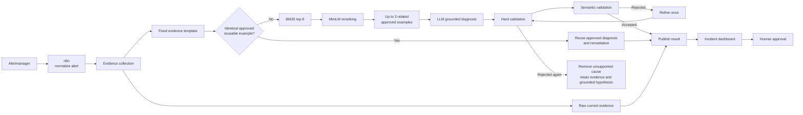

# Evidence-First Incident Diagnosis Agent

Vroom's incident agent turns an Alertmanager notification into an investigation that an operator can inspect and challenge. It does not remediate the cluster autonomously: the alert provides scope and impact context, while current observations determine what the agent may say about the incident.

The design separates two outcomes. An identical, human-approved incident example can reuse its approved diagnosis and remediation. When the evidence is only similar, the agent presents related guidance and a grounded, explicitly unconfirmed hypothesis instead of treating similarity as proof.

## Why it exists

An application alert rarely contains enough information to explain why a service is failing. Operators normally need to move between metrics, logs, traces, Kubernetes state, and workload configuration before they can decide what to do. The agent reduces that search cost by collecting those sources into one incident record, while preserving the observations needed to verify its conclusion.

The system is designed around four boundaries:

- **Evidence before explanation.** Structured logs, correlated trace facts, Kubernetes state and events, safe workload configuration diffs, and operational context remain visible.
- **Recognition is separate from knowledge.** An approved example recognizes observable incident evidence; knowledge holds the human-approved diagnosis and remediation associated with that example.
- **Confidence changes behavior.** Exact reusable evidence can confirm an approved diagnosis. Related retrieval can only guide an unconfirmed hypothesis.
- **Generated text is guarded.** Hard and semantic validation prevent a generated explanation from becoming a confirmed cause unless it is supported by current evidence.

## End-to-end architecture



Raw current evidence is published to the dashboard regardless of the decision path. A failed generation therefore does not hide the logs, trace, configuration diff, or workload state that an operator needs to continue the investigation.

## Alert intake and current evidence

n8n receives Alertmanager's webhook, expands grouped alerts, and sends one normalized request to `POST /investigate` for each alert. It supplies scope and trigger facts only; it does not supply an inferred incident category or cause.

```json
{
  "fingerprint": "4f1acd2082fa645e",
  "starts_at": "2026-08-12T14:25:40.619Z",
  "alert_name": "DLQEventsDetected",
  "service": "dispatch-service",
  "namespace": "vroom-dev",
  "pod": "",
  "severity": "warning",
  "status": "firing",
  "metric_value": 1.08,
  "threshold": 0
}
```

For the affected workload, the agent collects:

- trigger and scope facts from the alert;
- the selected structured error log;
- an exactly correlated trace when that log supplies a trace ID;
- Kubernetes workload state and warning events;
- a safe workload configuration diff, such as an environment-variable or resource-limit change;
- operational context: request rate, p95 latency, HTTP error rate, and current CPU/memory use relative to configured limits.

Metrics provide impact and runtime context; they do not independently prove a cause. Missing telemetry is recorded as missing rather than silently converted to a healthy zero.

A trace is marked correlated only when the selected log supplies its trace ID and the relevant error span agrees with the scoped failure through service, operation, or message. A trace found only by a broad service search is not promoted to causal evidence. Similarly, configuration provenance is limited to an observable workload state/diff: the agent does not infer that a particular image or commit caused the incident.

## Normalized evidence template

Collectors retain raw facts for display and diagnosis, then normalize decisive observations into a stable retrieval template. The template uses the same field layout for a current incident and an approved example:

```text
alert_name
service
triggering_metric
waiting_reason
last_terminated_reason
event_reason
event_message
log_error
trace_error_service
trace_error_operation
trace_error_message
configuration_diff
```

This is a concise recognition representation, not a rule-based diagnosis classifier. It normalizes concrete observations so two incidents can be compared; it does not decide that an observation is normal, abnormal, or causal. Operators and the LLM still have access to the richer current-evidence records.

## Knowledge, approved examples, and retrieval hints

The agent separates approved meaning from the evidence used to recognize it.

**Knowledge** is the human-approved diagnosis and remediation for a reusable failure family:

```json
{
  "knowledge_key": "unsupported_event_contract",
  "diagnosis_cause": "Producer and consumer event contracts differ.",
  "remediation": "Align the event contract versions before replaying the DLQ.",
  "created_by": "reviewer",
  "updated_at": "2026-08-12T17:30:00Z"
}
```

An **approved example** links immutable observed evidence to that knowledge:

```json
{
  "example_id": "example-dlq-v2",
  "knowledge_key": "unsupported_event_contract",
  "fingerprint": "sha256-of-normalized-evidence",
  "evidence": {
    "alert_name": "DLQEventsDetected",
    "service": "dispatch-service",
    "log_error": "unknown event type Trip.Requested.v2",
    "trace_error_operation": "dispatch.consume.Trip.Requested.v2"
  },
  "hint_ids": ["event-contract", "unsupported-event-type"],
  "exact_reusable": true,
  "approved_by": "reviewer",
  "approved_at": "2026-08-12T17:30:00Z"
}
```

A **global retrieval hint** is reviewer-approved vocabulary that can improve recall across knowledge families:

```json
{
  "hint_id": "event-contract",
  "text": "producer consumer schema or event contract version mismatch"
}
```

Retrieval searches observable evidence plus approved hints. Diagnosis and remediation are loaded after candidate selection, so they do not become lexical tokens that falsely make an incident look similar.

## Exact reuse

Exact reuse requires a complete normalized evidence fingerprint identical to one approved example marked `exact_reusable=true`. In this path, the approved diagnosis and remediation are returned directly. BM25, MiniLM, and LLM generation are bypassed because a human has already approved this specific evidence-to-knowledge association for reuse.

The rule is intentionally strict: a change in any normalized evidence field moves the incident to advisory handling. This favors precision over recall. A partial similarity never receives deterministic confirmation merely because it resembles a familiar failure family.

## Advisory retrieval with BM25 and MiniLM

When no reusable exact example exists, the agent retrieves related guidance in two stages.

1. BM25 searches the normalized evidence and globally approved hints, selecting up to eight candidates. Rare error tokens, operations, service names, event types, configuration fields, and hints provide useful lexical anchors.
2. MiniLM reranks that narrowed set semantically and returns at most three distinct related knowledge families.

The fixed template does not make BM25 redundant. Incident wording still varies: an error can expose a hostname, event type, operation name, resource field, or a reviewer-created hint that is lexically decisive. MiniLM then helps distinguish paraphrases and related wording inside a small candidate set.

The returned examples are advisory. Their rank is not causal proof, and the design does not claim a calibrated no-match threshold. Operators see the guidance because it may shorten their investigation, but it cannot confirm the current incident by itself.

## Grounded LLM generation

The configured LLM runs only for the non-exact path. It receives current evidence plus up to three related approved guidance items. Current evidence grounds its claims; retrieved knowledge supplies possible interpretations, not facts about the live incident.

The generation contract includes:

- `evidence_analysis` grouped by the collected evidence;
- `incident_summary` describing the observed failure;
- `diagnosis_cause` only when support is sufficient;
- `hypothesis` for a plausible but explicitly unconfirmed explanation;
- `recommended_action` for the next safe operator action;
- `used_knowledge_keys`, `evidence_refs`, and `hypothesis_evidence_refs` to expose the sources behind the response.

For example, a dispatch log that rejects `Trip.Requested.v2` and an agreeing trace can support a hypothesis that producer and consumer contracts are incompatible. They do not by themselves allow the agent to assert which deployment or change introduced the mismatch.

## Output guardrails

Two validation layers constrain non-exact output.

- **Hard validation** checks the structured contract, required fields, evidence-reference integrity, and confirmation boundaries. A hypothesis must cite valid supporting observations; a diagnosis cause cannot be promoted without its evidence references.
- **Semantic validation** checks whether the explanation follows from current collected evidence and whether advisory knowledge has been over-promoted into a claim about the current incident.

The agent refines a rejected answer once. If it still fails validation, it removes the unsupported `diagnosis_cause` while preserving the raw evidence and a cited hypothesis when that hypothesis is explicitly unconfirmed and grounded. This downgrade is intentional: it keeps the investigation useful without presenting speculation as a confirmed root cause.

## Human review and reusable learning

The dashboard shows incident identity, decision status, incident summary, diagnosis cause or hypothesis, raw current evidence, operational context, related approved guidance, and a recommended next action. The agent does not execute remediation.

n8n sends a compact Slack advisory for quick awareness. For a review-required
incident it deliberately contains a summary, `Diagnosis cause: Not confirmed`,
a grounded hypothesis, decisive evidence, and a read-only investigation command
rather than remediation. The dashboard remains the full evidence surface.


For an advisory incident, a reviewer can approve it as a reusable example after checking the evidence, attach it to existing knowledge or create a new knowledge family, edit its diagnosis/remediation, and add or reuse global hints. A reviewer may also retain it as advisory-only. Human approval is the boundary that promotes observed evidence into trusted knowledge.

## Verified scenarios

### DLQ contract mismatch — exact reuse

`ride-service` publishes `Trip.Requested.v2`. `dispatch-service` rejects the unsupported event after retries and the DLQ alert fires. The agent collects the structured `unknown event type` log and a correlated trace that follows the event to `dispatch.consume.Trip.Requested.v2`. Because the normalized evidence is identical to an approved reusable example, it bypasses retrieval and generation, returning the approved contract-mismatch diagnosis and remediation.

The operator can still inspect the log, trace, current Kubernetes state, and operational context before aligning contract versions and deciding whether to replay the DLQ.


### DLQ contract mismatch — advisory diagnosis

This scenario produces the same general failure family without an identical reusable fingerprint. The dispatch structured error and cross-service trace remain decisive observations. BM25 and MiniLM return related approved guidance; the LLM turns that current evidence into an unconfirmed contract-version hypothesis and the guardrails check its references and confirmation boundary.

The operator receives useful guidance but no false confirmation. They must verify the producer and consumer contract versions before approving the incident as a reusable example.


### Redis endpoint configuration failure

`ride-service` receives an invalid `REDIS_ADDR`, causing name-resolution failures during startup. The agent collects the previous and current workload configuration values, the Redis dial error, pod restart state, and scoped operational context. There is no identical reusable example, so the configuration change remains an explicitly unconfirmed hypothesis while related approved guidance is shown.

The next safe action is to verify the workload diff and restore the known Redis endpoint, rather than treating temporal proximity as automatic causal proof.


## Design decisions and trade-offs

- Fixed normalization improves comparison and keeps retrieval input compact, but it cannot express every useful raw detail.
- Strict exact reuse favors precision over recall; even small template differences take the advisory path.
- BM25 plus MiniLM provides practical lexical and semantic retrieval without requiring a simulated calibration dataset for a no-match threshold. Weak or unrelated guidance can still appear, so it never confirms the live cause.
- Configuration diffs provide temporal context and concrete values, not a universal explanation for failures.
- Hard and semantic guardrails reduce unsupported claims, but no validation layer can guarantee a perfect diagnosis from a low-cost LLM or incomplete telemetry.
- The quality of trusted knowledge depends on the reviewer who approves examples and hints.

## Components and interfaces

The Flask agent exposes `POST /investigate` and incident/knowledge administration APIs. Its collectors query Prometheus, Loki, Tempo, and Kubernetes; `retrieval/` contains the Redis-backed approved corpus, BM25 selection, and MiniLM reranking; `diagnosis_v2.py`, `validation.py`, and the interpreter implement grounded generation and validation; `runtime_v2.py` stores the presentation-ready incident record. n8n normalizes Alertmanager webhooks, while the React dashboard displays evidence and supports review.

## Current limitations

The system is intentionally scoped to observable workload evidence and a small approved corpus. It does not chase arbitrary dependencies, attribute failures to commits or images, execute cluster remediation, or turn missing telemetry into a healthy signal. Novel incidents may still require manual diagnosis; their value to the system begins only when a reviewer approves a precise, reusable example.
