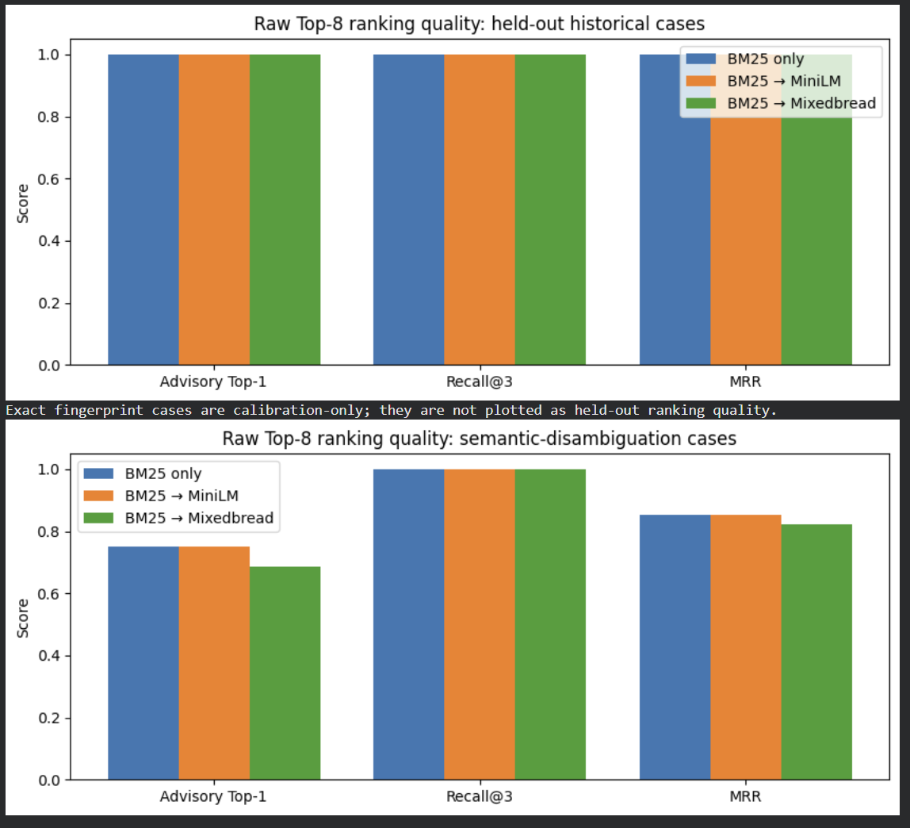
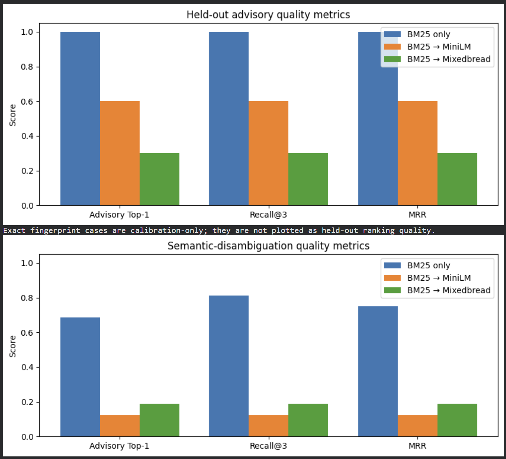
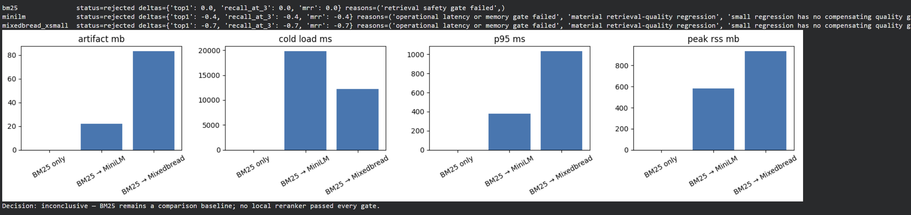

# Retrieval model-selection experiment

## Decision

Keep BM25 as the retrieval baseline. Do not retain MiniLM or Mixedbread as production rerankers on the evidence collected in this experiment.

This is a rejection of the tested reranker configurations, not a claim that neural reranking can never help. A future contender needs to improve the same frozen raw-ranking benchmark and meet the operational gates.

## Question

Does reranking the clean incident agent's BM25 evidence candidates with a local MiniLM or Mixedbread cross-encoder provide enough ranking improvement to justify its operational cost?

The evaluated systems were:

- **BM25 only** — lexical evidence retrieval and its existing BM25 acceptance rule.
- **BM25 → MiniLM** — the same BM25 Top-8 candidate set, reordered by MiniLM.
- **BM25 → Mixedbread** — the same BM25 Top-8 candidate set, reordered by Mixedbread.

## Method

The clean retrieval contract was used throughout:

`normalized evidence → exact fingerprint check → BM25 Top-8 → optional reranker → acceptance rule`

The experiment deliberately separates two questions:

1. **Raw candidate-ranking quality:** the expected diagnosis's position in the unfiltered BM25 Top-8. This measures whether a reranker improves ordering.
2. **Complete-pipeline behavior:** each system's existing calibrated acceptance threshold, false positives, abstentions, forbidden acceptances, latency, and memory. This measures deployability.

The historical regression benchmark has 40 frozen cases. The semantic-disambiguation benchmark has 16 labelled cases: 8 archive-derived and 8 explicitly labelled synthetic stress cases. Synthetic cases are not presented as historical incidents.

## Raw-ranking results

Historical cases are lexically easy: all three systems reached 1.00 on raw Top-1, Recall@3, and MRR. This is useful as a regression check, but is not evidence that reranking adds value.

On the semantic-disambiguation benchmark, where BM25 must choose among keyword-sharing candidate families:

| System | Top-1 | Recall@3 | MRR |
|---|---:|---:|---:|
| BM25 only | 0.75 | 1.00 | 0.85 |
| BM25 → MiniLM | 0.75 | 1.00 | 0.85 |
| BM25 → Mixedbread | 0.69 | 1.00 | 0.82 |

MiniLM tied BM25; Mixedbread regressed slightly. All systems had Recall@3 of 1.00, so BM25 candidate generation already placed the expected family in the Top-3 for every semantic case. Neither reranker improved the order enough to justify its cost.

The captured raw-ranking output is available in [candidate_ranking_results.txt](ranking_evaluation/candidate_ranking_results.txt).

## Complete-pipeline results

Applying the existing calibrated acceptance rules substantially reduced neural complete-pipeline quality. This is reported separately because it reflects both ranking and acceptance behavior; it must not be mistaken for raw reranking quality.

| Benchmark | BM25 Top-1 | MiniLM Top-1 | Mixedbread Top-1 |
|---|---:|---:|---:|
| Historical held-out | 1.00 | 0.60 | 0.30 |
| Semantic | 0.69 | 0.12 | 0.19 |
| Synthetic semantic stress | 0.38 | 0.00 | 0.12 |

The traces show that neural candidates can exist but be removed by the model-specific score floor. That is a separate calibration/acceptance finding, not proof that the raw reranker always chose the wrong candidate.

The captured complete-pipeline output is available in [evaluation_results.txt](complete_evaluation/evaluation_results.txt).

## Operational and safety gates

The local rerankers also failed the deployment gates used for this experiment:

- MiniLM exceeded the 500 MB peak RSS budget (about 580 MB).
- Mixedbread exceeded the 500 MB budget (about 930 MB) and the 1,000 ms p95 budget (about 1,030 ms).
- Neither reranker provided a raw-ranking gain that could justify these costs.

BM25 is retained as the **comparison baseline**, not declared automatically production-safe: the current complete-pipeline safety check found one forbidden accepted candidate that needs a separate review.

## Reproduction notebooks

Run the two notebooks to reproduce the raw-ranking and complete-pipeline evaluations: [raw_model_selection_colab.ipynb](../raw_model_selection_colab.ipynb) and [complete_model_selection_colab.ipynb](../complete_model_selection_colab.ipynb).

## Limitations and next steps

- The benchmark is small: 40 historical regression cases and 16 semantic cases. It supports an engineering decision for this project, not a broad claim about all incident-diagnosis systems.
- Historical cases have more lexical overlap with the knowledge corpus than the synthetic semantic stress cases. The report therefore emphasizes the raw semantic result rather than historical 1.00 scores.
- Sparse evidence is realistic. The dataset intentionally has varied evidence coverage rather than filling every template field artificially.
- Before promoting any future reranker, repeat the same raw-ranking and complete-pipeline evaluation on more archive-derived incidents, then require no material quality regression, a justified trade-off if any, and all safety/latency/memory gates to pass.

## Evaluation Conclusion

BM25-only retrieval was evaluated against BM25 candidate generation followed by MiniLM or Mixedbread reranking. Raw Top-8 ranking quality was evaluated separately from calibrated acceptance behavior to isolate reranking performance from threshold effects. On the semantic-disambiguation benchmark, MiniLM provided no measurable ranking improvement over BM25, while Mixedbread showed a slight regression. Both neural rerankers also exceeded the defined local resource constraints. Based on these results, BM25 was retained as the retrieval approach, while MiniLM and Mixedbread were rejected as production candidates under the current benchmark and deployment constraints.
